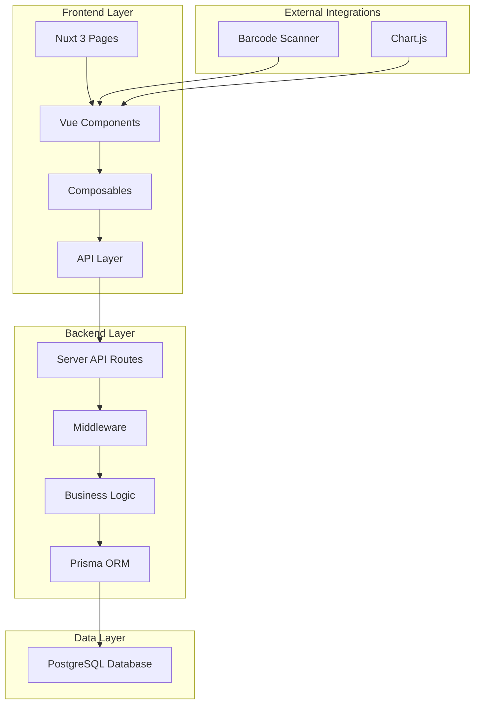

# Design Document - Multi-Tenant Inventory Management System

## Overview

This design document outlines the architecture for a multi-tenant inventory management system built on the existing Nuxt 3 + Prisma + Tailwind CSS foundation. The system will be extended to support multi-tenancy, role-based access control, barcode scanning, inventory management, and comprehensive reporting capabilities.

The system leverages the existing CRM structure and extends it with new entities and functionality while maintaining the current authentication patterns and UI framework choices.

## Architecture

### System Architecture



### Multi-Tenant Architecture

The system implements tenant isolation at the database level using a `tenantId` field across all tenant-specific entities. This approach ensures:

- Data isolation between different stores
- Simplified queries with automatic tenant filtering
- Scalable architecture that can grow with business needs

### Technology Stack

- **Frontend**: Nuxt 3, Vue 3, TypeScript
- **Styling**: Tailwind CSS, shadcn-vue components
- **Backend**: Nuxt Server API, Prisma ORM
- **Database**: PostgreSQL 
- **Authentication**: JWT with role-based access control
- **Barcode Scanning**: @teckel/vue-barcode-reader
- **Charts**: Chart.js
- **Validation**: Yup with VeeValidate

## Components and Interfaces

### Database Schema Design

```prisma
// Tenant (Store) model
model Tenant {
  id        String   @id @default(uuid())
  name      String
  address   String?
  contact   String?
  createdAt DateTime @default(now())
  updatedAt DateTime @updatedAt
  
  // Relations
  users     User[]
  products  Product[]
  invoices  Invoice[]
  
  @@map("tenants")
}

// Extended User model with roles and tenant association
model User {
  id       Int      @id @default(autoincrement())
  email    String   @unique
  password String
  username String?
  role     UserRole @default(SELLER)
  
  // Multi-tenant support
  tenantId String?
  tenant   Tenant? @relation(fields: [tenantId], references: [id])
  
  // Relations
  contacts Contact[]
  invoices Invoice[]
  
  createdAt DateTime @default(now())
  updatedAt DateTime @updatedAt
  
  @@map("users")
}

enum UserRole {
  ADMIN
  SELLER
}

// Product model
model Product {
  id          Int      @id @default(autoincrement())
  name        String
  description String?
  category    String?
  
  // Multi-tenant support
  tenantId String
  tenant   Tenant @relation(fields: [tenantId], references: [id])
  
  // Relations
  variants ProductVariant[]
  
  createdAt DateTime @default(now())
  updatedAt DateTime @updatedAt
  
  @@map("products")
}

// Product Variant model
model ProductVariant {
  id       Int     @id @default(autoincrement())
  barcode  String  @unique
  weight   Float
  price    Decimal @db.Decimal(10, 2)
  stock    Int     @default(0)
  
  // Relations
  productId Int
  product   Product @relation(fields: [productId], references: [id])
  
  // Multi-tenant support (denormalized for performance)
  tenantId String
  
  // Relations
  invoiceItems InvoiceItem[]
  
  createdAt DateTime @default(now())
  updatedAt DateTime @updatedAt
  
  @@map("product_variants")
}

// Invoice model
model Invoice {
  id          Int     @id @default(autoincrement())
  totalAmount Decimal @db.Decimal(10, 2)
  
  // Relations
  userId Int
  user   User @relation(fields: [userId], references: [id])
  
  // Multi-tenant support
  tenantId String
  tenant   Tenant @relation(fields: [tenantId], references: [id])
  
  // Relations
  items InvoiceItem[]
  
  createdAt DateTime @default(now())
  updatedAt DateTime @updatedAt
  
  @@map("invoices")
}

// Invoice Item model
model InvoiceItem {
  id         Int     @id @default(autoincrement())
  quantity   Int
  unitPrice  Decimal @db.Decimal(10, 2)
  totalPrice Decimal @db.Decimal(10, 2)
  
  // Relations
  invoiceId Int
  invoice   Invoice @relation(fields: [invoiceId], references: [id])
  
  variantId Int
  variant   ProductVariant @relation(fields: [variantId], references: [id])
  
  createdAt DateTime @default(now())
  updatedAt DateTime @updatedAt
  
  @@map("invoice_items")
}
```

### API Route Structure

```
/api/
├── auth/
│   ├── login.post.ts
│   ├── logout.get.ts
│   ├── me.get.ts
│   └── register.post.ts
├── admin/
│   ├── tenants/
│   │   ├── index.get.ts
│   │   ├── index.post.ts
│   │   └── [id].put.ts
│   ├── products/
│   │   ├── index.get.ts
│   │   ├── index.post.ts
│   │   ├── [id].put.ts
│   │   └── [id].delete.ts
│   ├── invoices/
│   │   └── index.get.ts
│   └── reports/
│       └── sales.get.ts
└── seller/
    ├── variants/
    │   └── [barcode].get.ts
    ├── invoices/
    │   ├── index.get.ts
    │   └── index.post.ts
    └── products/
        └── index.get.ts
```

### Frontend Component Architecture

```
components/
├── ui/                    # shadcn-vue components
│   ├── Button.vue
│   ├── Input.vue
│   ├── Table.vue
│   └── Chart.vue
├── barcode/
│   ├── BarcodeScanner.vue
│   └── ScanResult.vue
├── inventory/
│   ├── ProductForm.vue
│   ├── ProductList.vue
│   ├── VariantForm.vue
│   └── StockManager.vue
├── sales/
│   ├── SalesCart.vue
│   ├── InvoiceForm.vue
│   └── InvoiceHistory.vue
├── admin/
│   ├── Dashboard.vue
│   ├── TenantManager.vue
│   └── ReportsPanel.vue
└── layout/
    ├── AdminLayout.vue
    └── SellerLayout.vue
```

### Page Structure

```
pages/
├── index.vue              # Login page
├── register/
│   └── index.vue          # Registration page
├── admin/
│   ├── index.vue          # Admin dashboard
│   ├── tenants/
│   │   ├── index.vue      # Tenant management
│   │   └── [id].vue       # Tenant details
│   ├── products/
│   │   ├── index.vue      # Product management
│   │   └── [id].vue       # Product details
│   ├── invoices/
│   │   └── index.vue      # All invoices view
│   └── reports/
│       └── index.vue      # Reports and analytics
└── seller/
    ├── index.vue          # Seller dashboard
    ├── sales/
    │   └── index.vue      # Sales interface with barcode scanner
    └── invoices/
        └── index.vue      # Seller's invoice history
```

## Data Models

### Core Entities

#### Tenant
- **Purpose**: Represents individual stores in the multi-tenant system
- **Key Fields**: id (UUID), name, address, contact
- **Relationships**: One-to-many with Users, Products, Invoices

#### User (Extended)
- **Purpose**: System users with role-based access
- **Key Fields**: id, email, password, role (ADMIN/SELLER), tenantId
- **Relationships**: Many-to-one with Tenant, One-to-many with Invoices

#### Product
- **Purpose**: Product catalog items
- **Key Fields**: id, name, description, category, tenantId
- **Relationships**: Many-to-one with Tenant, One-to-many with ProductVariants

#### ProductVariant
- **Purpose**: Specific product variations with barcode and pricing
- **Key Fields**: id, barcode (unique), weight, price, stock, productId, tenantId
- **Relationships**: Many-to-one with Product, One-to-many with InvoiceItems

#### Invoice
- **Purpose**: Sales transactions
- **Key Fields**: id, totalAmount, userId, tenantId, createdAt
- **Relationships**: Many-to-one with User and Tenant, One-to-many with InvoiceItems

#### InvoiceItem
- **Purpose**: Individual line items in invoices
- **Key Fields**: id, quantity, unitPrice, totalPrice, invoiceId, variantId
- **Relationships**: Many-to-one with Invoice and ProductVariant

### Data Validation Rules

- **Barcode**: Must be unique across the entire system
- **Stock**: Cannot be negative
- **Prices**: Must be positive decimal values with 2 decimal places
- **Quantities**: Must be positive integers
- **Email**: Must be unique and valid format
- **Tenant Assignment**: Sellers must be assigned to exactly one tenant

## Error Handling

### API Error Responses

```typescript
interface ApiError {
  statusCode: number;
  message: string;
  details?: string[];
  timestamp: string;
}
```

### Error Categories

1. **Authentication Errors** (401)
   - Invalid credentials
   - Expired tokens
   - Missing authentication

2. **Authorization Errors** (403)
   - Insufficient permissions
   - Tenant access violations
   - Role-based restrictions

3. **Validation Errors** (400)
   - Invalid input data
   - Business rule violations
   - Constraint violations

4. **Resource Errors** (404)
   - Product not found
   - Barcode not found
   - Tenant not found

5. **Business Logic Errors** (422)
   - Insufficient stock
   - Duplicate barcode
   - Invalid operations

### Error Handling Strategy

- **Frontend**: Global error handler with toast notifications
- **Backend**: Structured error responses with proper HTTP status codes
- **Database**: Transaction rollback on errors
- **Logging**: Comprehensive error logging for debugging

## Testing Strategy

### Unit Testing
- **Composables**: Authentication, data fetching, business logic
- **Components**: UI components with Vue Test Utils
- **API Routes**: Server-side logic and validation
- **Database**: Prisma model operations

### Integration Testing
- **API Endpoints**: Full request/response cycle testing
- **Authentication Flow**: Login, logout, role verification
- **Multi-tenant Isolation**: Data separation verification
- **Barcode Scanning**: End-to-end scanning workflow

### E2E Testing
- **User Workflows**: Complete user journeys for both roles
- **Sales Process**: Barcode scan to invoice completion
- **Admin Operations**: Product management and reporting
- **Cross-tenant Security**: Unauthorized access prevention

### Performance Testing
- **Database Queries**: Query optimization and indexing
- **API Response Times**: Load testing for concurrent users
- **Frontend Performance**: Component rendering and state management
- **Barcode Scanning**: Scanner responsiveness and accuracy

### Testing Tools
- **Unit**: Vitest
- **E2E**: Playwright or Cypress
- **API**: Supertest
- **Database**: Prisma test database

## Security Considerations

### Authentication & Authorization
- JWT tokens with role and tenant information
- Secure password hashing with bcrypt
- Token expiration and refresh mechanisms
- Role-based route protection

### Data Security
- Tenant data isolation at database level
- Input validation and sanitization
- SQL injection prevention through Prisma
- XSS protection with proper escaping

### API Security
- Rate limiting on authentication endpoints
- CORS configuration
- Request size limits
- Secure headers implementation

## Performance Optimizations

### Database Optimizations
- Proper indexing on frequently queried fields
- Database connection pooling
- Query optimization with Prisma
- Pagination for large datasets

### Frontend Optimizations
- Component lazy loading
- Image optimization
- Bundle splitting
- Caching strategies

### Caching Strategy
- API response caching
- Static asset caching
- Database query result caching
- Client-side state management

## Migration Strategy

### Database Migration
1. **Schema Evolution**: Extend existing schema with new entities
2. **Data Migration**: Migrate existing users to new role-based system
3. **Tenant Setup**: Create default tenant for existing data
4. **Index Creation**: Add performance indexes

### Code Migration
1. **Authentication Extension**: Extend existing auth system with roles
2. **API Restructuring**: Organize routes by user role
3. **Component Refactoring**: Update existing components for new UI framework
4. **State Management**: Extend composables for new functionality

This design provides a solid foundation for implementing the multi-tenant inventory management system while leveraging the existing Nuxt 3 infrastructure and maintaining consistency with current patterns.